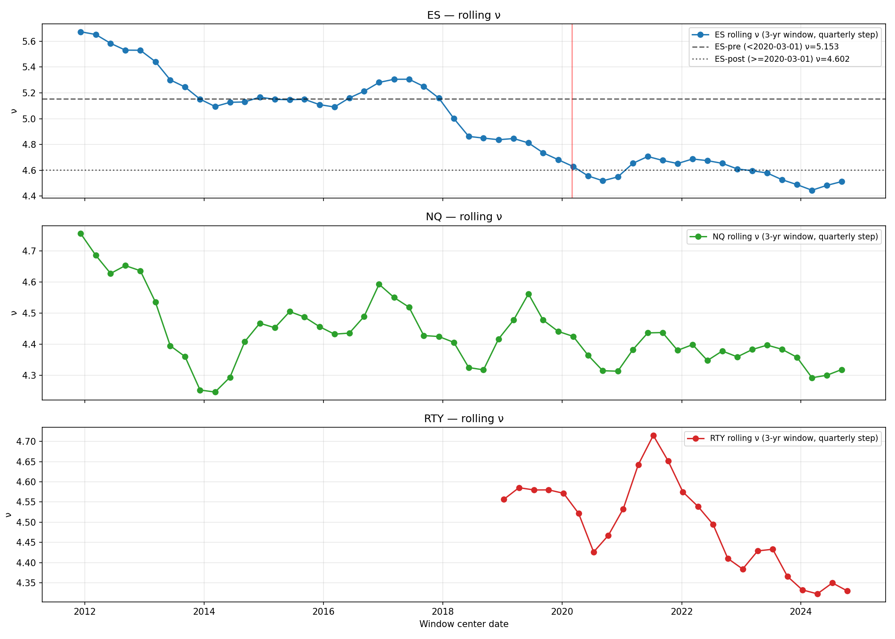
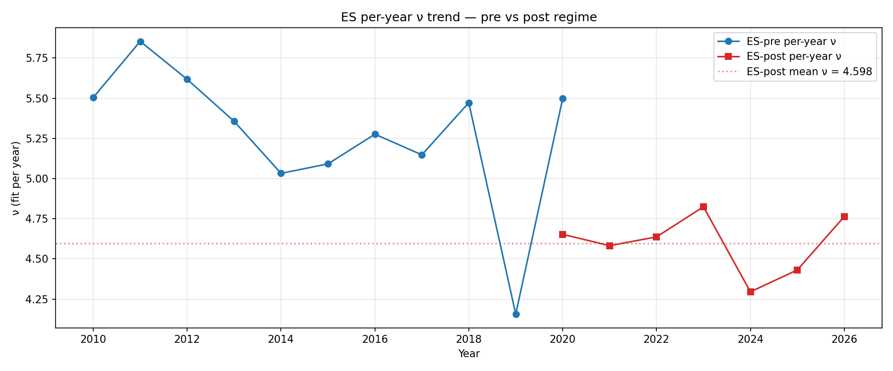

# Student-t Bulk Volume Classification for Equity Index Futures

Companion code and artifacts for a methodology paper on
Student-t adapted Bulk Volume Classification (BVC). Applied to 5-minute OHLCV
bars of CME equity index futures (ES, NQ, RTY). Regime Classifier proved to be robust however directional signal was absent from all results. 

## Scope

This repository implements the full OHLCV-only pipeline that will be described in the
paper:

1. **Student-t BVC estimator** (`src/features/student_t_bvc.py`) — a
   heavy-tailed generalization of the standard BVC framework that
   classifies bar volume into buy/sell components using the Student-t
   CDF of a causally calibrated z-score.
2. **Causal calibration** (`src/calibration/`) — descriptive and fully
   causal estimation of the Student-t degrees-of-freedom ν and scale σ
   using only past data; includes diagnostic sensitivity checks and a
   PIT-based validation suite.
3. **Regime-break analysis** (`src/regime/`) — identification and
   robustness testing of a 2020-era structural break in ν, with monthly
   stabilization and per-year validation.
4. **Physics-motivated features** (`src/features/physics_features.py`,
   `docs/PHYSICS_FEATURES.md`) — a 14-feature set derived from OHLCV
   geometry and intra-bar flow, designed to be orthogonal to the
   baseline BVC measures.
5. **Stage-1 volatility prediction** (`src/volatility_prediction/`) —
   walk-forward forecasting of next-bar realized volatility using the
   14-feature set, evaluated against causal Garman-Klass baselines.
6. **Directional null result** (`src/directional_test/`) — a structured
   72-cell test establishing that OHLCV-derived BVC imbalance does not
   produce directional signal at the 5-minute horizon on equity index
   futures.

## Repository layout

```
src/
  features/          Student-t BVC estimator, physics features
  calibration/       Causal & descriptive ν, σ estimation + diagnostics
  regime/            Regime-break detection and validation
  volatility_prediction/   Stage-1 training, metrics, baselines
  directional_test/  Phase 3C directional signal evaluation
docs/
  PHYSICS_FEATURES.md      Mathematical definitions of the 14 features
  METHODOLOGY.md           Standalone summary of the full pipeline
results/
  calibration_tables/      Phase 1 / 2 calibration artifacts
  regime_break/            Phase 1 regime-break outputs
  stage1_volatility/       Stage-1 forecasting results + SHAP
  phase3c_directional/     72-cell directional null result
scripts/
  data_prep/               CSV → Parquet utilities for raw Databento data
  run_full_pipeline.py     End-to-end driver
data/
  README.md                Data acquisition instructions
```

## Quickstart

### 1. Environment

```bash
python -m venv .venv
source .venv/bin/activate       # Windows: .venv\Scripts\activate
pip install -r requirements.txt
```

### 2. Data

CME Globex 1-minute OHLCV bars for ES, NQ, RTY over 2010-01-01 to
2025-12-31 were sourced from Databento (schema: `ohlcv-1m`). See
`data/README.md` for acquisition instructions. Place the raw CSV files
under `data/raw/`.

### 3. Run the pipeline

```bash
# Convert raw CSVs to per-contract Parquet
python scripts/data_prep/convert.py

# Full end-to-end driver
python scripts/run_full_pipeline.py
```

Individual stages can also be run directly from `src/`; see
`docs/METHODOLOGY.md` for details.

## Key results

- **Calibration.** Student-t ν estimates stabilize to contract-specific
  values (ES ≈ 3.0, NQ ≈ 3.3, RTY ≈ 3.5) over the post-2020 training
  window. See `results/calibration_tables/15year_cleaned/`.
- **Regime break.** A structural break in ν around 2020 is robust
  across break-date sensitivity, rolling-window, and
  monthly-stabilization analyses. See
  `results/regime_break/PHASE1_LOCK_FINAL.md`.

  
- **Volatility prediction.** The 14-feature physics set delivers a
  consistent improvement over the causal Garman-Klass baseline on
  walk-forward MSE. See `results/stage1_volatility/STAGE1_RESULTS.md`.
- **Directional null.** Across 72 evaluation cells (three gates × two
  tiers × three contracts × four horizons), no BVC-imbalance-gated
  configuration produces directional accuracy meaningfully above the
  48–49% lag-1 mean-reverting baseline. See
  `results/phase3c_directional/DIRECTIONAL_TEST_RESULTS.md`.

## Reproducibility

All analyses use:
- Fixed random seeds where stochastic components appear.
- Causal (past-data-only) parameter estimation for every feature and
  every calibration step.
- Session-isolated rolling statistics (session boundary = instrument
  roll or > 15-minute gap).
- Walk-forward evaluation with frozen warmup windows.

Re-running any stage produces byte-identical artifacts on the same
input data and Python environment.

## License

MIT. See `LICENSE`.
